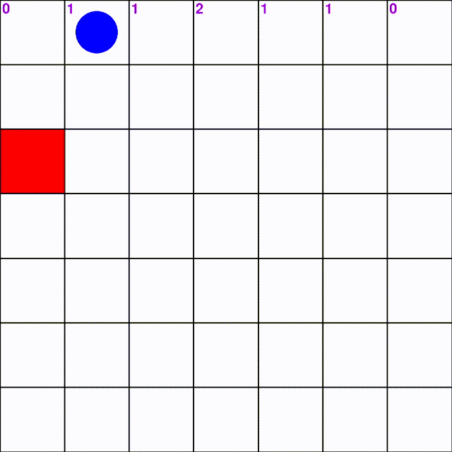
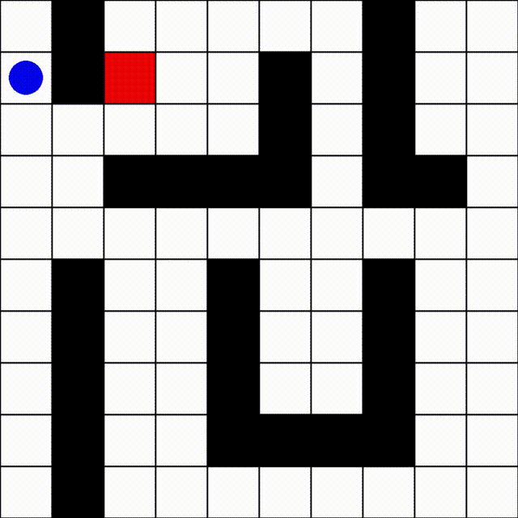
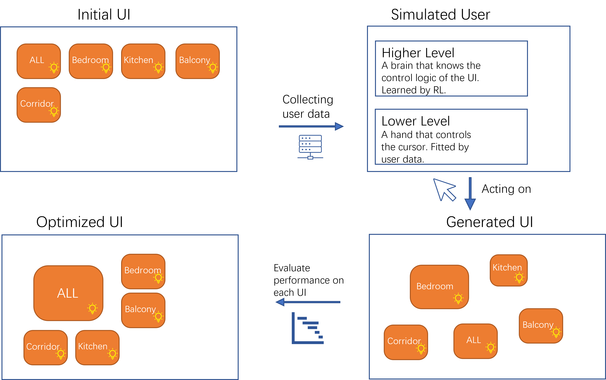
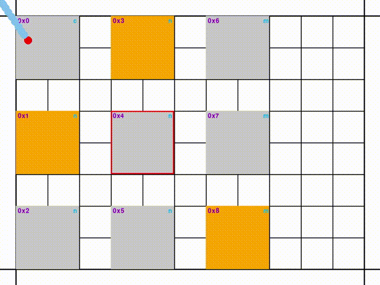

# Reinforcement Learning and Application in Human Computer Interaction
This repository aims to provide a simple and concrete tutorial on how to build and run your own reinforcement learning environment using `ray-rllib`, and some applications in the domain of HCI. 

## RL basics

For basics in reinforcement learning, please refer to the famous book 
[Sutton Reinforcement Learning Book](https://web.stanford.edu/class/psych209/Readings/SuttonBartoIPRLBook2ndEd.pdf) and some other very useful resources: [Introduction to SMDP](https://www.sciencedirect.com/science/article/pii/S0004370299000521), [Multi Agent Reinforcement Learning](https://www.dcsc.tudelft.nl/~bdeschutter/pub/rep/10_003.pdf).

And here are some other resources that you might be interested in:  
- [Proximal Policy Optimization Algorithms](https://arxiv.org/abs/1707.06347)
- [Reinforcement Learning - State of the Art](https://link.springer.com/book/10.1007/978-3-642-27645-3)
- [Goal Conditioned Reinforcement Learning](https://proceedings.neurips.cc/paper/2019/file/c8cc6e90ccbff44c9cee23611711cdc4-Paper.pdf)


## Set up conda environment

### Install conda/miniconda

If you don't have conda or miniconda installed on your computer, install it first following the [official tutorial](https://docs.conda.io/en/latest/miniconda.html). If you have it already, ignore this section.

For linux/wsl user, run 

```bash
curl -sL \
  "https://repo.anaconda.com/miniconda/Miniconda3-latest-Linux-x86_64.sh" > \
  "Miniconda3.sh"
```

to download the miniconda installer. Install miniconda by running

```bash
bash Miniconda3.sh
```

Restart your Terminal. Now your prompt should list which environment is active. After installation, delete the installer

```bash
rm Miniconda3.sh
```

The `(base)` environment is thereafter activated by default the next time you start your terminal. To disable auto-activation, run
```bash
conda config --set auto_activate_base false
```

### Create environment from .yml file
To install all pakages required for this repository, run

```bash
conda env create -f environment.yml
conda activate RL
```

If you want to play with conda environments, see [conda cheatsheet](https://docs.conda.io/projects/conda/en/4.6.0/_downloads/52a95608c49671267e40c689e0bc00ca/conda-cheatsheet.pdf).

### Utilities

We will use mainly `gym` and `ray-rllib` pakages. I list their officil documentation here:
- [gym](https://www.gymlibrary.ml/)
- [ray-rllib](https://docs.ray.io/en/releases-1.11.0/rllib/index.html)

However, the official website of `ray` does not provide a very comprehensive tutorial and API documentation. That's what we will see in the next two sections.

In the end, we use [wandb](https://wandb.ai/site) to visulize the experiment results.


## How to build a single-agent environment

First of all, to ensure that ray library is installed correctly and to get a first look, run the `taxi.py` python script

```bash
cd src/RL_tutorial
python taxi.py
```

Normally you should see something like this

```bash
(RolloutWorker pid=2302) +---------+
(RolloutWorker pid=2302) |R: | : :G|
(RolloutWorker pid=2302) | : | : : |
(RolloutWorker pid=2302) | : : : : |
(RolloutWorker pid=2302) | | : | : |
(RolloutWorker pid=2302) |Y| : |B: |
(RolloutWorker pid=2302) +---------+
(RolloutWorker pid=2302)   (South)
(RolloutWorker pid=2302) +---------+
(RolloutWorker pid=2302) |R: | : :G|
(RolloutWorker pid=2302) | : | : : |
(RolloutWorker pid=2302) | : : : : |
(RolloutWorker pid=2302) | | : | : |
(RolloutWorker pid=2302) |Y| : |B: |
(RolloutWorker pid=2302) +---------+
(RolloutWorker pid=2302)   (South)
```

### Common Paradigm
<!-- We all know that a reinforcement learning problem is mainly composed of **state**, **action**, **reward**, **policy**. An agent takes an action against the current state following a policy and then the state transits into another state.  -->
You can find a tutorial [on the official webside of `gym`](https://www.gymlibrary.ml/content/environment_creation/). We will improve the example it provides by adding wind to the grid world. In a word, in this example an agent is trying to reach a randomly generated goal starting from a random position. A 
constant wind blows from bottom of the grid to the top. 



In Python language, to customize your own environment, you should define a class inherited from `gym.Env`. There are four components that your must specify in your class: two properties `action_space` and `observation_space`, and two methods `step(action)` and `reset()`. Besides, it's a good practice to define the state of the environment a property of the class. 

```python
import gym
class YourEnv(gym.Env):

def __init__(self):
    self.action_space = some_action_space # Define your action space here
    self.observation_space = some_observation_space # Define your observation space here
    self.state = some_state # Optional

def get_obs(self): # Get the current observation. Optional
    obs = {}
        for key in self.observation_space:
            obs[key] = self.state[key]
    return obs

def step(self,action):
    # Take a step here
    reward: float = some_reward
    done: bool = done_or_not
    add: dict = {}
    return self.get_obs(), reward, done, add

def reset(self):
    # Reset the environment here
    return self.get_obs()

def render(self): # Visulize your environment. Optional
    pass
```

#### Implementation details

- `action_space`: This is exactly the same thing as you see in reinforcement learning language, i.e. $\mathcal{A}$, the space of actions that the agent can take. A general way to specify the space is using what `gym.spaces` provides [here](https://www.gymlibrary.ml/content/spaces/). For example, in [windy_grid.py](src/RL_tutorial/windy_grid.py), there are four actions that the agent can take: go up, down, left,right. We could thus define the action space as a discrete space of 4 choices and define a action mapping function. 
- `observation_space`: This is what the agent sees. The agent takes an action based on the its observation on the current state. An observation could be a subset of the state or the same as the state w.r.t. whether it's MDP or POMDP. The observation_space is defined the same way as the action space. In [windy_grid.py](src/RL_tutorial/windy_grid.py), since it's a goal-conditioned reinforcement learning problem, the agent can see its own position and the goal position. 
- `step(action)`: In this function, the agent takes the `action` provided in the parameter. During training, the `action` is supplied by the trained policy. You need to update the state of the environment and return four elements:
    - `observation`: a dictionary that must have the same keys as the `observation_space`. You could define additionally a method `self._get_obs()` to get the current observation.
    - `reward`: the reward(a scalar, positive or negative) the agent get for taking the action.
    - `done`: a boolean indicates if the episode is over(the agent finishs its task or terminated because the epsiode is too long).
    - `add`: a dictionary that contains anything else that you want the function to return.
- `reset()`: reset the environment. In [windy_grid.py](src/RL_tutorial/windy_grid.py), the agent and the goal are regenerated randomly. A current observation needs to be returned.

You can now play with the [windy_grid.py](src/RL_tutorial/windy_grid.py) example. To take a look at the environment, run
```bash
python windy_grid.py --demo
```
To train the agent, run 
```bash
python windy_grid.py --train
```
and a visualization of the trained model will be showed. As the agent needs to learn every possible case of starting location and goal position, the state space is quite large, so it needs some time to learn. 

There is another example [corridor.py](src/RL_tutorial/corridor.py) that ray-rllib provides, which is simpler than the windy grid. You could also play around with it. 

### How to train an RL agent

To train an RL agent on an environment, you could code as follows:

```python
from ray.rllib.agents import ppo
from ray.tune.logger import pretty_print
from environment import YourEnv # put environment.py in the same folder as this file is in

env_config = some_initialization_parameter # Define your initialization parameter here
config = {
    "env": YourEnv, # The customized environment you defined
    "env_config": env_config, # Parameters passed to YourEnv for initialization
    "num_gpus": 0, # Use GPUs iff `RLLIB_NUM_GPUS` env var set to > 0.
    "num_workers": 1,  # parallelism
    "framework": "torch", # or tf
    "gamma": 0.9 # discount rate
}
stop = { # When conditions below satisfied, stop training 
    "training_iteration": 1000,
    "timesteps_total": 100000,
    "episode_reward_mean": -1,
}

config = {**ppo.DEFAULT_CONFIG, **config}
trainer = ppo.PPOTrainer(config=config)
# run manual training loop and print results after each iteration
for _ in range(stop["training_iteration"]):
    result = trainer.train()
    print(pretty_print(result))
    if (
            result["timesteps_total"] >= stop["timesteps_total"]
            or result["episode_reward_mean"] >= stop["episode_reward_mean"]
        ):
            break
```

When you do experiments, a better way is to use `ray.tune` and let `ray` do the training automatically with parameters you provide. We show an example about how to train an agent on a windy grid.

```python
import ray
from windy_grid import WindyGrid
from ray.rllib.agents import ppo
from ray import tune

ray.init(local_mode=False, num_cpus=8, num_gpus=0)
env_config = {
      "size":tune.grid_search([5, 7, 10]), # Setting parameters you want to tune
  }
    
config = {
    "env": WindyGrid,  
    "env_config": env_config,
    "num_gpus": 0,
    "num_workers": 1,
    "framework": "torch",
    "gamma": 0.9,
    "log_level": "CRITICAL",
    "seed": 31415,
}

stop = {
    "training_iteration": 1000,
    "episode_reward_mean": -1,
}

config = {**ppo.DEFAULT_CONFIG, **config}
results = tune.run( 
        ppo.PPOTrainer,
        stop=stop,
        config=config,
        local_dir="ray_results",
        verbose=1,
        checkpoint_freq=50,
        checkpoint_at_end=True,
        num_samples=1,
    )

ray.shutdown()
```

## How to build a multi-agent environment


`ray` provides a good tutorial on building a mult-agent environment [Rise Camp Fall 2021 RLlib Tutorial](https://colab.research.google.com/drive/1pRxOjSszukN5X0B7EO_YvGPEIZ7P-zdP). In their tutorial, two agents act at the same time. We make a fancier example here where agents act in turn and obstcles appear in the arena. Please refer to [chase.py](src/RL_tutorial/chase.py).

To define a multi-agent environment, we define a class inherited from `MultiAgentEnv` provided in the `ray` library. Policy, observation space, action space and reward for every agent must be specified. This is done by first specifying the agent ids and then defining the observation space and the action space to be a dictionary, with keys being the agent ids and values being what we have done for singe-agent environment. 

To make the agents act in turn, we need to provide only the observation for the active agent in the `step(action)` function. Note that `action`, `reward`, `done` must also be dictionary with keys being agent ids. In addition, `done` must have an item with key `'__all__'` to indicate whether the whole episode is done or not. That's almost all the changes w.r.t. a single-agent environment.

In addition, you could define the action space and observation space elsewhere, i.e. defining a dictionary called `policies` and supply it in the `config`. If you don't define it, `ray` will use the dictionries named `action_space` and the `observation_space`. and match them to `agent_id`.

```python
policies = {
    'chase': (
        None, # Type of the policy
        env.observation_space['chaser'], # observation space
        env.action_space['chaser'], # action space
        {}
    ),
    'escaper':(
        None,
        env.observation_space['escaper'],
        env.action_space['escaper'],
        {}
    )
}
```


## Application in HCI: button panel

We discuss a case of button panel here. A button panel is a window contains a set of buttons. Each button can either be ON or OFF, like a switch. Pressing one button may affect status of other buttons. We use reinforcement learning to train a higher level agent which is able to decide which button to press when a goal pattern is provided. The lower level agent is a simulation of the cursor controled by the user, fitted by user data and models discovered in experiments thus not learned. You could also try to train a lowver level agent but the training could be slow and might not converge. The models we use are listed below:
- WHo model:
[A mathematical description of the speed/accuracy trade-off of aimed movement](https://dl.acm.org/doi/abs/10.1145/2783446.2783574). The main conclusion of the paper is that the more accurate the user want to be, the slower the movement is. It's an exteansion to the Fitts law.

- Minimum jerk movement:
[Minimum Jerk Trajectory Generation for Straight and Curved Movements: Mathematical Analysis](https://arxiv.org/ftp/arxiv/papers/2102/2102.07459.pdf#:~:text=The%20minimum%20jerk%20trajectory%20as,is%20the%20free%2Dhand%20motion). We assume that the trajectory of the curosr is a minimum jerk movement. 

- Fitts Law:
[The information capacity of the human motor system in controlling the amplitude of movement](https://psycnet.apa.org/record/1955-02059-001). This is a famous law that's widly used in UI design, describing human behavior in target selection. 

When we have a simulated user, we could let it act on different layouts of button panel and test which kind of 
layout is the best. To automate the process of finding the best UI, we use simulated annealing, which is a 
metaheuristic method. 

### The Button Panel



As showed above is a sample UI. It's composed of several elements:
- Margin: space where buttons could not occupy
- Grid: the left-top corner of a button must be at a grid point
- Button:
  - On the left-top corner of a button is the id
  - Right-top corner is the type, with 'c' being central, 'n' being normal, 'm' being mutually exclusive
  - Yellow means ON, gray means OFF
  - The red contour means the goal pattern(buttons need to be turned on)
- Trajectory:
  - The red circle is the goal position
  - Light blue shows the trajectory
  - Dark blue is the inital position

More implementation details can be found in [Interface.py](src/HCI_basic/Interface.py).

### UI opimization
Once we have a simulated user, we could let it perform on a certain layout of the UI and find the best one for our user. The user data is composed of the accuracy, pattern distribution, etc. Please refer to [find_best_ui.py](src/HCI_basic/find_best_ui.py). However, after testing, this method is not going to work because:
1. the cost function is not deterministic
2. the search space is too big when we have more buttons
3. different layouts may have similar cost

If you are interested in this topic, you could improve this method or even create your own method. Good luck!